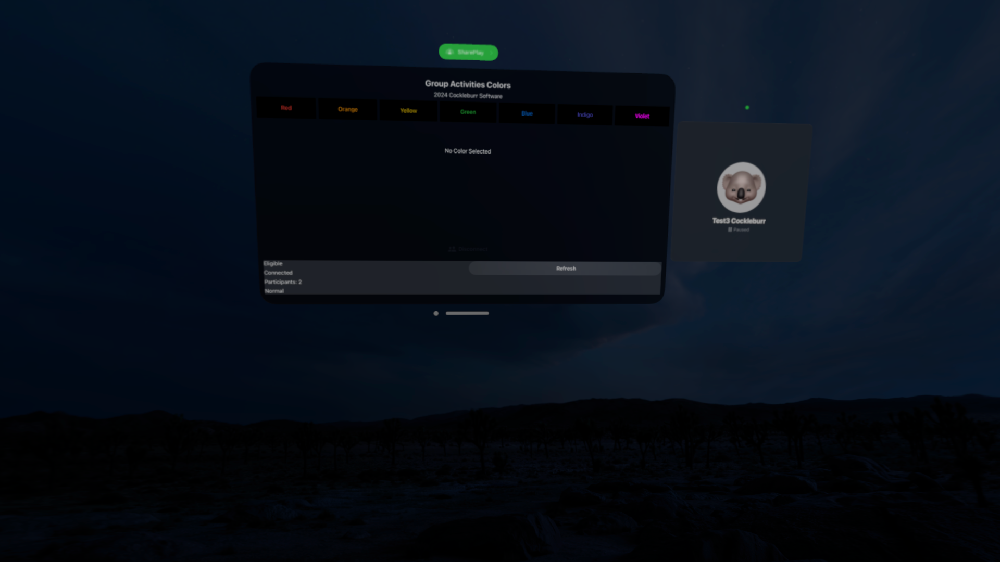

# GroupActivitiesPuppies

This is s proof-of-concept demonstrator for the new Group Activities for FaceTime available with iOS 15. It's an extension of my [MultipeerPuppies](https://github.com/bwake2012/MultiPeerPuppies) proof-of-concept demonstrator.

Here's a link to video of an [early version](https://youtu.be/utvN5USIeCU).

## Acknowledgments:

### [Build custom experiences with Group Activities](https://developer.apple.com/videos/play/wwdc2021/10187)

The talk at WWDC2021 that got me started playing with Group Activities. It includes a demo and parts of the code for a shared whiteboard app.

### [Using SharePlay to create a custom shared experience over FaceTime](https://wwdcbysundell.com/2021/using-shareplay-to-create-a-custom-shared-experience/)

Thanks to [@_inside](https://twitter.com/_inside) for [tweeting](https://wwdcbysundell.com/2021/using-shareplay-to-create-a-custom-shared-experience/) this and getting me off my duff. I spent an afternoon making this work. 

### [Meet Group Activities](https://developer.apple.com/videos/play/wwdc2021/10183)

This is the SharePlay introduction video.

### [Coordinate media experiences with Group Activities](https://developer.apple.com/videos/play/wwdc2021/10225)

This talk has useful tidbits for starting the session, even if your application has nothing to do with media.

### [Design for Group Activities](https://developer.apple.com/videos/play/wwdc2021/10184)

This talk also has useful tidbits.

## Objects and Protocols

### GroupStateObserver

This object will tell you if a FaceTime call is in progress. Its observable boolean member variable, _isElegibleForGroupSession_ turns true if you have a connection.

### _ActivityType_: GroupActivity

_GroupActivity_ is a protocol to define the topic for the session. The session is tied to a particular activity.

### GroupSession\<ActivityType\>

I don't know if an application may have multiple types of sessions going at one time. It is at least possible. An activity type is necessary but not suffient to identify a session. Two different apps using the same _activityIdentifier_ will not connect.

### GroupSessionMessenger

This is the source and sink for messages in the session. Create it, passing the session object, when you get a new or modified session.

### GroupActivityHandler

This class distills what I currently know about GroupActivities.

* It will handle sessions for one activity. 
* It will send and receive messages so long as they conform to the _GroupActivityMessage_ protocol, which adds requirements for a UUID based identifier and a timestamp to the base requirement that messages conform to Codable. This way the handler can tell if a message is older than the most recent one received. 
* I tried to remove any app specific logic from it.
* It provides a delegate based interface to GroupActivities

### Areas for Further Study

I still don't understand the session life cycle. I don't know what backgrounding and foregrounding the app actually does to a session, or how to recover from it.
